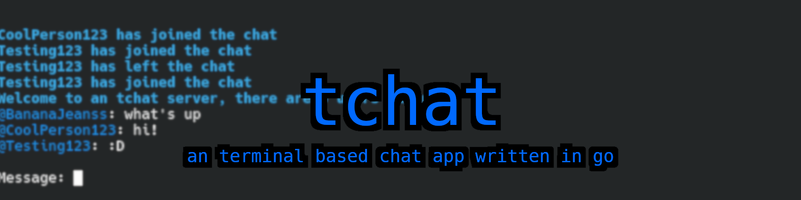

<div align="center">


<br>

an terminal based chat app written in go

[](LICENSE)
[](https://github.com/BananaJeanss/tchat/stargazers)
[](https://github.com/BananaJeanss/tchat/releases)
[](https://github.com/BananaJeanss/tchat)
[](https://github.com/BananaJeanss/tchat/commits/main)
[](https://github.com/BananaJeanss/tchat/issues)
[](https://github.com/BananaJeanss/tchat/actions/workflows/clientgo.yml)
[](https://github.com/BananaJeanss/tchat/actions/workflows/servergo.yml)
[](https://github.com/BananaJeanss/tchat/actions/workflows/nest.yml)

</div>

<br>

## Features

tchat provides you with all the basic and necessary features to chat with others, whether for public chatrooms, or private chats, both on the client and serverside.

### Clientside

- Basic commands such as //clear, //ping, //mute and more
- Configurable username, color, and theme
- A cool banner at the top of the terminal
- Message rate limiting
- Chat history of up to 10 messages on new connection
- Cross-platform support

### Serverside

- Configurable server name, port, and password protection
- Message character limit enforcement
- Optional profanity filter
- Optional message logging to file
- Basic admin commands such as //broadcast, //clearchat, //ban, and more.
- IP ban support (non-persistent as of now)
- Optionally sends recent chat history to new clients
- Duplicate username and reserved name usage prevention
- Password-protected server

> [!NOTE]  
> By default, the client `tchatconfig.json` will connect to the default server which should be online 24/7.

## Client Usage Guide

Getting started with the tchat client is easy:

1. **Download the Client**

   - Visit the [releases](https://github.com/BananaJeanss/tchat/releases) page.
   - Download the latest executable for your operating system (Windows, Linux, or macOS).

2. **Run the Client**

   - Open a terminal (Command Prompt, PowerShell, Terminal, etc.).
   - Navigate to the directory where you downloaded the executable.
   - Run the executable:
     - **Windows:**  
       `tchat.exe`
     - **Linux/macOS:**  
       `./tchat`

3. **Configuration**

   - If it doesn't exist already, the `tchatconfig.json` file will be created in the same directory with default settings.
   - You can edit this file to change your username, color, server address, port, and other preferences.

4. **Connecting**
   - The client will automatically connect to the server specified in your `tchatconfig.json`.
   - If the server requires a password, set it in the `serverPassword` field in your config.

**Running on Windows**

```sh
cd path\to\download\folder
tchat.exe
```

**Running on Linux/macOS**

```sh
cd /path/to/download/folder
chmod +x tchat
./tchat
```

### List of Commands

| Command               | Description                    |
| --------------------- | ------------------------------ |
| `//clear`             | Clear your chat window         |
| `//ping`              | Check your connection latency  |
| `//color <color>`     | Change your username color     |
| `//mute <username>`   | Mute messages from a user      |
| `//unmute <username>` | Unmute a previously muted user |
| `//mutelist`          | Show your list of muted users  |
| `//exit` / `//quit`   | Quit the client                |

### tchatconfig.json

```json
{
  "color": "blue", // Your username color in chat (ANSI color name)
  "port": 9076, // Port number to connect to on the server
  "server": "37.27.51.34", // Server IP address or hostname
  "serverPassword": "", // Password for the server (if required)
  "themeColor": "blue", // Theme color for the banner and default server messages
  "username": "user" // Your username (3-20 characters)
}
```

## Server Setup Guide

Follow these steps to set up and run your own tchat server:

1. **Navigate to the Server Directory**

   Open a terminal and go to the `server` directory:

   ```sh
   cd server
   ```

2. **Configure the Server**

   - Edit the `tchatconfig.json` file in the `server` directory to customize server settings such as port, server name, password protection, message character limit, and more.
   - If the file does not exist, it will be created with default settings on first run.

3. **Run the Server**

   - Build and start the server using Go:
     ```sh
     go run main.go
     ```
   - Or, to build a standalone executable:
     ```sh
     go build -o tchat-server main.go
     ./tchat-server
     ```

4. **Client Connection**

   - Clients can now connect to your server using the IP address and port specified in your `tchatconfig.json`.
   - If password protection is enabled, share the server password with your users.

> [!WARNING]  
> Note that password protection is not 100% secure, as of now it's sent via plaintext.

> [!IMPORTANT]  
> The server must be accessible over the network (ensure your firewall allows the chosen port, setup port forwarding if needed).
> IP bans are not persistent and will reset if the server restarts.

### Server Commands

| Command                 | Description                                     |
| ----------------------- | ----------------------------------------------- |
| `//broadcast <message>` | Send a message to all connected clients         |
| `//clearchat`           | Clear the chat history for all users            |
| `//ban <username>`      | Ban a user by username (IP ban, non-persistent) |
| `//kick <username>`     | Disconnect a user by username                   |

### tchatconfig.json

```json
{
  "logMessages": false, // Enable to log all chat messages to chat.log
  "messageCharLimit": 180, // Maximum characters allowed per message
  "passwordProtected": false, // Require a password for clients to join
  "port": 9076, // Port number the server listens on
  "profanityCheck": true, // Enable automatic profanity filtering
  "sendMessageHistory": true, // Send the last 10 messages to new clients
  "serverName": "an tchat server", // Name displayed to clients
  "serverPassword": "" // Password required if passwordProtected is true
}
```

## Screenshots

<table>
    <tr>
        <th>Server</th>
        <th>Client</th>
    </tr>
    <tr>
        <td align="center"></td>
        <td align="center"></td>
    </tr>
</table>

## Contributing

Contributions are welcome! Please feel free to:

- Report bugs by [opening an issue](https://github.com/BananaJeanss/tchat/issues)
- Suggest features via the [feature request template](https://github.com/BananaJeanss/tchat/issues)
- Submit pull requests for improvements

Make sure your contribution follows the general guidelines, and if you're opening a pull request, that it isn't being worked on by someone else already.

### Contributors:

[](https://github.com/BananaJeanss/tchat/graphs/contributors)

## License

This project is licensed under the MIT License, see the [LICENSE](LICENSE) file for details.

---

<div align="center">
  <a href="https://shipwrecked.hackclub.com/?t=ghrm" target="_blank">
    
  </a>
</div>
